# Runway Finance - Entity Relationship Diagram (ERD)

This document contains the Entity Relationship Diagram for the Runway Finance application database schema.

## Mermaid ERD Diagram

```mermaid
erDiagram
    User ||--o{ Account : "has many"
    User ||--o{ Transaction : "has many"
    User ||--o{ Asset : "has many"
    User ||--o{ Liquidation : "has many"
    User ||--o{ Liability : "has many"
    User ||--o{ CreditCardStatement : "has many"
    User ||--o| SalarySweepConfig : "has one"
    User ||--o{ DetectedEMIPattern : "has many"
    User ||--o{ NetWorthSnapshot : "has many"
    
    Account ||--o{ Transaction : "has many"
    Account ||--o{ CreditCardStatement : "has many"
    
    Merchant ||--o{ Transaction : "has many"
    
    SalarySweepConfig ||--o{ DetectedEMIPattern : "has many"
    
    Transaction }o--o| Asset : "links to"
    Transaction }o--o| Liquidation : "links to"
    
    Liability }o--o| DetectedEMIPattern : "links to"
    Asset }o--o| DetectedEMIPattern : "links to"

    User {
        string user_id PK
        string username UK
        string email UK
        string password_hash
        boolean is_active
        datetime created_at
        datetime updated_at
    }

    Account {
        string account_id PK
        string user_id FK
        string account_number_ref
        string account_type
        string bank_name
        string account_name
        string currency
        float current_balance
        boolean is_active
        datetime created_at
        datetime updated_at
    }

    Transaction {
        string transaction_id PK
        string user_id FK
        string account_id FK
        string merchant_id FK
        string date
        datetime timestamp
        float amount
        string type
        text description_raw
        text clean_description
        string merchant_raw
        string merchant_canonical
        string category
        string transaction_sub_type
        json labels
        float confidence
        float balance
        string currency
        float original_amount
        string original_currency
        string duplicate_of
        integer duplicate_count
        boolean is_duplicate
        string source
        string bank_name
        string statement_period
        datetime ingestion_timestamp
        json extra_metadata
        string linked_asset_id
        string liquidation_event_id
        string month
        boolean is_recurring
        string recurring_type
        string recurring_group_id
        datetime created_at
        datetime updated_at
    }

    Merchant {
        string merchant_id PK
        string merchant_canonical UK
        string category
        integer transaction_count
        float total_amount
        datetime created_at
        datetime updated_at
    }

    Asset {
        string asset_id PK
        string user_id FK
        string name
        string asset_type
        float quantity
        float purchase_price
        float current_value
        datetime purchase_date
        string recurring_pattern_id
        boolean liquid
        boolean disposed
        text notes
        datetime created_at
        datetime updated_at
    }

    Liquidation {
        string liquidation_id PK
        string user_id FK
        string asset_id
        string date
        float gross_proceeds
        float fees
        float net_received
        float quantity_sold
        text notes
        datetime created_at
    }

    Liability {
        string liability_id PK
        string user_id FK
        string name
        string liability_type
        float principal_amount
        float outstanding_balance
        float interest_rate
        float emi_amount
        string rate_type
        integer rate_reset_frequency_months
        float processing_fee
        float prepayment_penalty_pct
        integer original_tenure_months
        integer remaining_tenure_months
        string recurring_pattern_id
        datetime start_date
        datetime end_date
        datetime last_rate_reset_date
        integer moratorium_months
        string lender_name
        string status
        datetime closure_date
        string closure_reason
        datetime created_at
        datetime updated_at
    }

    CreditCardStatement {
        string statement_id PK
        string user_id FK
        string account_id FK
        string bank_name
        string card_number_masked
        string card_last_4_digits
        string customer_name
        string statement_start_date
        string statement_end_date
        string billing_period
        integer total_transactions
        integer transactions_processed
        string source_file
        string source_type
        boolean is_processed
        string processing_status
        text error_message
        json extra_metadata
        datetime created_at
        datetime updated_at
    }

    SalarySweepConfig {
        string config_id PK
        string user_id FK
        string salary_source
        float salary_amount
        float salary_account_rate
        float savings_account_rate
        string selected_scenario
        float monthly_interest_saved
        float annual_interest_saved
        json optimization_data
        boolean is_active
        datetime created_at
        datetime updated_at
    }

    DetectedEMIPattern {
        string pattern_id PK
        string config_id FK
        string user_id FK
        string merchant_source
        float emi_amount
        integer occurrence_count
        string category
        string subcategory
        boolean is_confirmed
        string user_label
        string suggested_action
        text suggestion_reason
        json transaction_ids
        string first_detected_date
        string last_detected_date
        datetime created_at
        datetime updated_at
    }

    NetWorthSnapshot {
        string snapshot_id PK
        string user_id FK
        string snapshot_date
        string month
        float total_assets
        float total_liabilities
        float net_worth
        float liquid_assets
        json asset_breakdown
        json liability_breakdown
        datetime created_at
    }
```

## Entity Descriptions

### Core Entities

#### User
- **Purpose**: Central entity for multi-user support
- **Relationships**: 
  - One-to-Many with Accounts
  - One-to-Many with Transactions
  - One-to-Many with Assets
  - One-to-Many with Liquidations
  - One-to-Many with Liabilities
  - One-to-Many with CreditCardStatements
  - One-to-One with SalarySweepConfig
  - One-to-Many with DetectedEMIPatterns
  - One-to-Many with NetWorthSnapshots

#### Account
- **Purpose**: Represents bank accounts (savings, current, credit cards, etc.)
- **Relationships**:
  - Many-to-One with User
  - One-to-Many with Transactions
  - One-to-Many with CreditCardStatements
- **Notes**: Account numbers stored as vault references for security

#### Transaction
- **Purpose**: Canonical transaction schema storing all financial transactions
- **Relationships**:
  - Many-to-One with User
  - Many-to-One with Account (optional)
  - Many-to-One with Merchant (optional)
  - Optional link to Asset
  - Optional link to Liquidation event
- **Notes**: 
  - Supports deduplication
  - Includes ML categorization
  - Tracks recurring patterns
  - Multi-currency support

#### Merchant
- **Purpose**: Canonical merchant mapping for transaction categorization
- **Relationships**:
  - One-to-Many with Transactions
- **Notes**: Maintains statistics (transaction count, total amount)

### FIRE (Financial Independence, Retire Early) Entities

#### Asset
- **Purpose**: Tracks investments and assets (stocks, mutual funds, property, etc.)
- **Relationships**:
  - Many-to-One with User
  - Optional link to DetectedEMIPattern (if created from recurring investment)
- **Notes**: Can be liquid or illiquid

#### Liquidation
- **Purpose**: Tracks asset liquidation events
- **Relationships**:
  - Many-to-One with User
  - Referenced by Transactions via `liquidation_event_id`
- **Notes**: Records gross proceeds, fees, net received

#### Liability
- **Purpose**: Tracks loans, EMIs, and debts
- **Relationships**:
  - Many-to-One with User
  - Optional link to DetectedEMIPattern (if auto-created from recurring payments)
- **Notes**: 
  - Supports fixed/floating rates
  - Tracks tenure and remaining balance
  - Can link to EMI patterns

### Financial Optimization Entities

#### SalarySweepConfig
- **Purpose**: Configuration for Salary Sweep Optimizer feature
- **Relationships**:
  - One-to-One with User
  - One-to-Many with DetectedEMIPatterns
- **Notes**: Stores optimization scenarios and calculated savings

#### DetectedEMIPattern
- **Purpose**: Automatically detected recurring payment patterns (EMI, SIP, Insurance, etc.)
- **Relationships**:
  - Many-to-One with User
  - Many-to-One with SalarySweepConfig
  - Can link to Assets or Liabilities
- **Notes**: 
  - Used for salary sweep optimization
  - Can be confirmed by user
  - Stores transaction references

### Reporting & Analytics Entities

#### CreditCardStatement
- **Purpose**: Metadata tracking for credit card statement processing
- **Relationships**:
  - Many-to-One with User
  - Many-to-One with Account (optional)
- **Notes**: Tracks processing status and statement periods

#### NetWorthSnapshot
- **Purpose**: Monthly snapshots of net worth for timeline visualization
- **Relationships**:
  - Many-to-One with User
- **Notes**: 
  - One snapshot per month per user
  - Stores asset/liability breakdowns
  - Used for net worth timeline feature

## Key Relationships Summary

1. **User** is the central entity - all entities are scoped to a user
2. **Transactions** can optionally link to Accounts and Merchants
3. **Transactions** can reference Assets and Liquidations for FIRE tracking
4. **DetectedEMIPatterns** connect to SalarySweepConfig for optimization
5. **Liabilities** and **Assets** can be auto-created from DetectedEMIPatterns
6. **NetWorthSnapshots** aggregate Assets and Liabilities for reporting

## Indexes (for Performance)

- `idx_user_date` on Transaction(user_id, date)
- `idx_user_category` on Transaction(user_id, category)
- `idx_date_category` on Transaction(date, category)
- `idx_merchant_date` on Transaction(merchant_canonical, date)
- `idx_user_month` on Transaction(user_id, month)
- `idx_asset_user` on Asset(user_id)
- `idx_asset_recurring_pattern` on Asset(recurring_pattern_id)
- `idx_liquidation_user` on Liquidation(user_id, asset_id)
- `idx_liability_user` on Liability(user_id)
- `idx_liability_pattern` on Liability(recurring_pattern_id)
- `idx_net_worth_user_month` on NetWorthSnapshot(user_id, month)

## Database Constraints

- Unique constraint on Transaction to prevent exact duplicates (date, amount, description, balance)
- Foreign key constraints enforce referential integrity
- Cascade deletes ensure data cleanup when parent records are deleted

